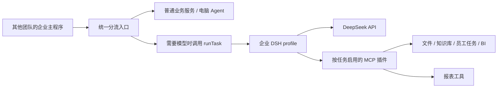

# 主程序与插件接入契约

需要按电脑／手机和功能分流的主程序，请先按 [统一入口接入约定](command-routing.md) 使用 `createCommandDispatcher`。下文描述它在需要模型时调用的底层 `runTask` 与原 CLI `run`，这些底层入口自身不做设备分流或请求去重。每项模型任务创建独立 DSH 子进程和私有配置补丁，结束后关闭进程并删除补丁；报表留在运行目录供主程序读取。

知识库专项作为完整 DSH `knowledge` 插件，按 [WeKnora 开发文档](weknora-development-plan.md) 与 [技术文档](weknora-technical-design.md) 实施：WeKnora 是插件内部引擎，插件返回授权且有效的原文证据，DSH 生成草稿，主程序的答案交付层复核引用、权限和版本后再展示。插件还拥有治理/反馈 API 与页面，但这些写操作不默认暴露为模型工具。该交付层是待实现目标；现有 `completed` 事件仅证明执行层任务完成，不证明答案已通过上述业务校验。



MCP 是模型上下文协议：它把外部服务提供的工具以统一方式交给 Agent 调用。DSH 使用 `mcp__<能力名>__<工具名>` 命名工具。本项目默认不暴露 DSH 自带的 shell、文件、网页、子 Agent 等模型工具；只把任务声明且已在配置中启用的 MCP 服务写入当次补丁。

## 任务格式

`examples/echo-task.json` 和 `examples/report-task.json` 是可运行样例。格式固定为版本 1：

```json
{
  "version": 1,
  "taskId": "business-task-001",
  "organizationId": "org-001",
  "requesterId": "user-001",
  "authorizationRef": "optional-opaque-reference",
  "prompt": "请完成任务",
  "capabilities": ["files", "knowledge", "employeeTasks", "bi", "reports"]
}
```

主程序必须先校验登录身份、组织归属和用户对资源的权限，再构造任务。DSH 验证字段格式和能力开关，不能代替主程序的真实授权。插件收到的身份字段也必须在业务服务端重新验证，尤其是 `authorizationRef`；不能相信模型回答里的身份信息。

`taskId`、`organizationId`、`requesterId` 使用 ASCII 标识符（字母、数字、点、下划线、冒号、连字符），因为它们也会作为 HTTP 插件的请求头发送。`authorizationRef` 使用单行 ASCII 文本，不能包含换行。

程序调用：

```js
import { runTask } from './dist/src/runner.js'

const controller = new AbortController()
const result = await runTask(task, {
  signal: controller.signal,
  timeoutMs: 600000,
  onEvent: (event) => process.stdout.write(`${JSON.stringify(event)}\n`),
})
```

事件为 `started`、`ready`、`tool_started`、`tool_finished`、`notification`、`completed`、`failed`、`cancelled`、`timed_out`。`completed` 含 `response`、`artifacts`、`toolCalls`、`sourceRefs`、`sessionId`。`sourceRefs` 只收集业务工具实际返回的来源标识，不把模型自己编造的引用算作已验证来源。调用方可用 `AbortController.abort()` 取消任务。一个 `runTask` 调用只执行一次用户任务，不复用前一任务的会话。

## 插件配置

`~/.dsh-huizhi/plugins.json` 按 `config/plugins.example.json` 格式配置。外部服务可用本机 stdio 进程或 Streamable HTTP MCP 端点。一个能力对应一个 MCP 服务；本项目负责启动和选择，并按开发计划实现完整 `knowledge` 插件。文件、员工任务和 BI 仍由对应团队实现。

本机 stdio 示例：

```json
"files": {
  "enabled": true,
  "transport": "stdio",
  "command": "/usr/bin/node",
  "args": ["/opt/huizhi/file-plugin/server.js"],
  "envFrom": { "SERVICE_TOKEN": "HUIZHI_FILE_SERVICE_TOKEN" }
}
```

HTTP 示例：

```json
"knowledge": {
  "enabled": true,
  "transport": "streamable-http",
  "url": "https://knowledge.example.internal/mcp",
  "headersFrom": { "Authorization": "HUIZHI_KNOWLEDGE_AUTHORIZATION" }
}
```

`envFrom` 和 `headersFrom` 的右侧是部署机的环境变量名，不是密钥值。任务运行期间密钥可能进入权限为 `0600` 的临时补丁；任务结束后补丁会删除。请由部署系统提供环境变量，不要写入 `plugins.json`。HTTP 插件会收到 `X-Huizhi-Task-Id`、`X-Huizhi-Organization-Id`、`X-Huizhi-Requester-Id` 和可选的 `X-Huizhi-Authorization-Ref`。stdio 插件从 `HUIZHI_TASK_CONTEXT_B64` 解码同一任务上下文。

每个启用的插件可选配 `toolCallTimeoutMs`，默认 60000 毫秒，允许 100 至 300000 毫秒。单任务总时限由 `runTask({ ... }, { timeoutMs })` 或 CLI `--timeout-ms` 设置，默认 600000 毫秒。

DSH 子进程默认只继承运行所需的基础环境变量，不继承其他服务的 Token。若部署环境必须使用代理，可设置 `HUIZHI_DSH_PASS_ENV=HTTPS_PROXY,NO_PROXY`，明确列出要额外传入 DSH 的变量名。

四组外部业务能力的接口由负责该服务的团队交付：

| 能力 | 负责团队应提供 | 本项目预留方式 |
| --- | --- | --- |
| `files` | 按权限读取文件及来源标识 | MCP 服务配置与任务开关 |
| `knowledge` | 按组织搜索知识并返回引用 | MCP 服务配置与任务开关 |
| `employeeTasks` | 查询或执行有权限的员工任务 | MCP 服务配置与任务开关 |
| `bi` | 返回受授权的指标及数据口径 | MCP 服务配置与任务开关 |
| `reports` | 本项目内置周报生成 | MCP 工具 `create_weekly_report` |

业务插件的工具名和参数由双方在联调时冻结。`test/mock-business-mcp.ts` 给出了测试用工具名和返回格式，**不代表生产服务实现**。任务没有声明或配置未启用的能力会在模型启动前被拒绝。插件连接失败由 DSH 报错；主程序应把任务标为失败或重试，不把缺失数据当成成功结果。

首版工具名与必填 JSON Schema 字段见 [插件契约 v1](plugin-contract-v1.md)。启用正式服务后运行 `node dist/src/cli.js plugins check` 验证契约；不合格服务不得加入正式任务。

执行层还会在每个任务启动 DSH 前用该任务的身份对所选外部插件进行只读契约检查。不符合契约、不可连接或返回版本不符的服务会使任务直接失败；不会让模型在缺失工具的情况下猜测结果。

若任一 MCP 工具在本次模型运行中返回错误，任务最终标记为 `failed`，即使模型随后生成文字答复也不会上报 `completed`。业务写操作是否已部分提交，仍须向对应服务查询；不要仅凭 DSH 的失败状态自动重复提交。

若取消或超时发生在 `employeeTasks.submit_task` 之后，执行层会用同一任务身份向外部插件尝试调用 `cancel_task`。取消结果会写入错误事件的 `externalTasks`；若未拿到外部任务编号或服务未确认，则 `externalStatus` 为 `pending_confirmation`，主程序必须继续查询外部状态。其他业务插件的副作用由对应服务自行提供幂等与补偿机制。

## 报表

内置 `reports.create_weekly_report` 接收周期、已完成、风险、下周计划三类条目，每条必须带 `sourceRefs`，生成中文 Markdown。模板位于 `templates/weekly.md.hbs`，使用开源 Handlebars。当前检查的是“来源字段非空”，并不能独立证明来源内容真实；主程序应只把可信文件或业务插件返回的来源用于正式周报。其他报表类型、Word/PDF 导出可按同一插件接口扩展，目前未实现。
