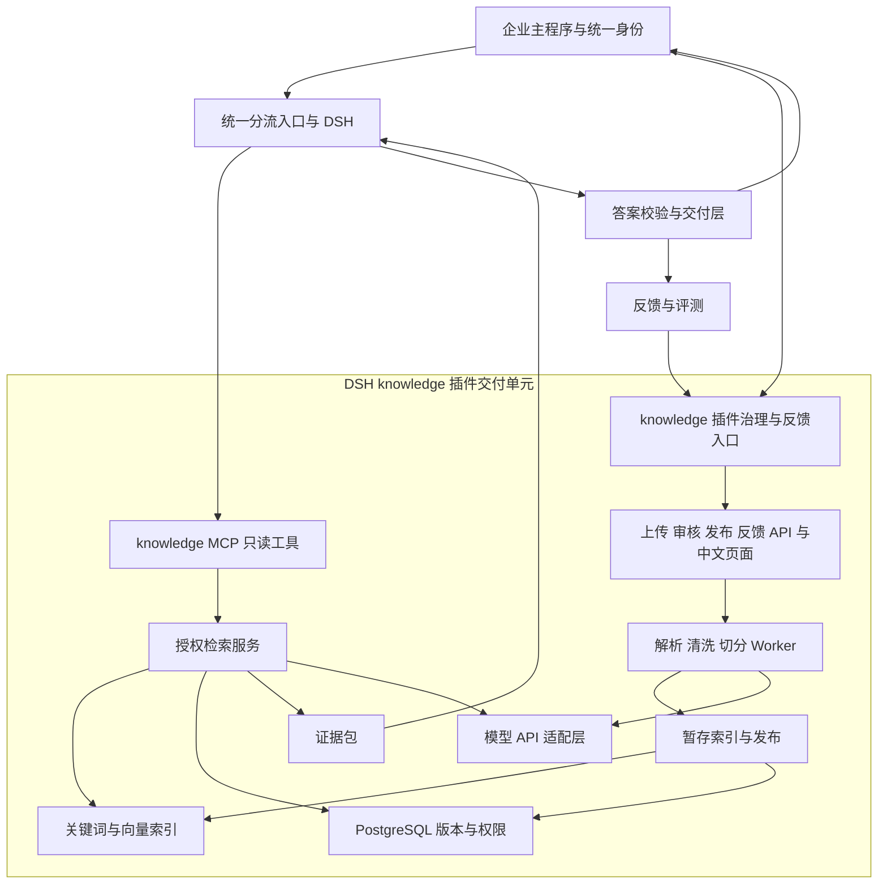
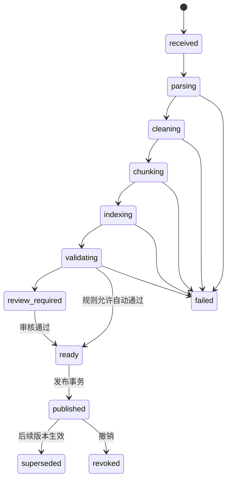

# WeKnora 企业知识中枢技术文档

文档版本：1.0  
确认日期：2026-09-27  
状态：当前项目已确认的目标设计；P1～P5 阶段内核及 P6 候选验收内核已开发，正式服务与业务验收仍待完成。  
实施顺序与验收：[开发文档](weknora-development-plan.md)  
P1 实施状态：[权限、版本与任务基础实施记录](weknora-p1-implementation.md)  
P2 实施状态：[解析、清洗、切分与索引实施记录](weknora-p2-implementation.md)  
P3 实施状态：[问答与慧智中枢接入实施记录](weknora-p3-implementation.md)  
P4 实施状态：[知识治理与发布工作台实施记录](weknora-p4-implementation.md)  
P6 实施状态：[试点与正式验收实施记录](weknora-p6-implementation.md)  
P5 实施状态：[反馈、运行与故障保障实施记录](weknora-p5-implementation.md)  
现有协议：[MCP 插件契约 v1](plugin-contract-v1.md)、[主程序接入](integration.md)

## 1. 范围、术语与约束

服务于企业内部 100 名员工，目标 10 人同时提问。首期内容为制度、合同、PDF、Word、扫描件及表格；OCR、Embedding、重排和大模型通过 API 调用。资料总量、供应商和生产规格尚未确定。

| 术语 | 本项目含义 |
| --- | --- |
| OCR | 从扫描页或图片识别文字，可同时获得版面与表格结构 |
| Embedding | 将文本转为用于相似度检索的向量 |
| Rerank | 对已召回的候选内容重新评估与问题的相关性 |
| BM25 | 根据词语匹配与词频进行文本检索的排序方法 |
| ACL | 文档允许或禁止哪些用户、部门、用户组访问的规则 |
| 发布快照 | 某次发布可使用的文档版本、处理构建及有效范围清单 |
| 派生知识 | 从原资料生成的摘要、FAQ、Wiki、实体、关系和表格解释 |
| Outbox | 将业务变更和待发送事件在同一个数据库事务中保存，再可靠投递的机制 |
| fencing token | 标识当前获准写入的任务代次，用于拒绝过期 Worker 的写入 |

实施必须满足：

1. 原件与权威文本可定位，任何清洗、切分和生成均保存来源。
2. 组织、用户、权限来自可信服务，模型不能扩大访问范围。
3. 当前有效答案只使用已发布、在适用时间内且获授权的资料。
4. 新版本准备与发布分离，半成品和旧任务写入不能影响正式知识。
5. 最终答案由 DSH 生成，知识服务返回证据；展示前另行进行业务校验。
6. 模型、Prompt、清洗、切分、索引配置均可追踪，供应商不能固定版本时记录该限制。

## 2. 当前基础与目标架构

### 2.1 已有实现

当前仓库为 Node.js / TypeScript DSH 执行层。已有 `createCommandDispatcher`、`runTask`、插件装配和工具契约检查。P1～P5 已新增可测试的 `knowledge` 领域、处理、问答、治理与运行内核，P6 已新增候选验收内核；正式完整插件服务、模型供应商适配、管理页面和 WeKnora 集成尚未实现。P0 的 `.runtime/` 上游检出只供源码核验。

已有 `knowledge.search_knowledge` 接收 `query: string`，输出 `hits: array`、`sourceRef: string`、`version: string`。任务通过环境变量或 HTTP 头传递身份信息，具体见 [插件契约](plugin-contract-v1.md)。此机制只传递上下文，服务端验证仍待知识库服务实现。

### 2.2 目标组件



| 组件 | 目标选择与职责 |
| --- | --- |
| 主程序/DSH | 复用现有 Node.js / TypeScript 入口、任务身份、生成及工具契约 |
| `knowledge` 插件 | 一个对主程序可安装、可配置、可升级的业务能力单元，包含 MCP 搜索、治理/反馈 API 与页面、Worker、引擎及插件级健康检查 |
| MCP 入口 | 插件内部只读工具服务，验证身份、调用授权检索、转换证据格式；继续使用一个 `knowledge` MCP 服务 |
| WeKnora 引擎 | 插件内部沿用上游 Go 后端和处理体系，扩展治理、发布、权限和读取闸门；原生 UI 仅作隔离调试 |
| 文档 Worker | 复用 Go 任务池与 Python 文档处理边界，按需求接入外部 OCR/处理服务 |
| 业务数据库 | PostgreSQL 保存版本、权限、审核、发布快照、来源、任务和审计 |
| 检索后端 | P0 固定源码默认 PostgreSQL；OpenSearch 是待测候选，须核验中文检索、权限过滤与模型维度兼容性后再选定 |
| 原件/产物存储 | S3 兼容对象存储；原件、解析结果、页面图及清洗结果分区保存 |
| 队列与缓存 | Redis；任务队列与可丢弃缓存使用独立资源策略，正式部署宜独立实例，避免缓存淘汰损坏队列 |
| 可观测性 | 复用上游追踪，连接 Langfuse/OpenTelemetry；指标与告警接现有运维系统，缺少时采用 Prometheus/Grafana/Alertmanager |

组件版本和资源限额在 P0 固定。初期容器化部署，在线请求与入库 Worker 设置独立并发和资源配额；不因模型走 API 而忽略 DSH 进程、索引和解析的本地资源消耗。

### 2.3 完整 DSH 插件边界

“完整插件”指知识产品的生命周期、数据、权限、页面和运行组件由 `knowledge` 能力统一负责；允许其内部使用多个服务或容器。主程序只负责可信会话、业务分流、插件装配、答案交付和页面挂载，不直接调用 WeKnora 内部表或绕过插件 API。WeKnora 是插件内部可替换的实现依赖，不是员工单独登录使用的第二套知识库。

员工问答走 `createCommandDispatcher` → DSH → `knowledge.search_knowledge` → 插件授权检索 → 证据 → DSH 草稿 → 主程序答案校验。管理员上传、处理预览、清洗审核、版本发布、权限配置和评测走主程序认证后的插件管理 API/页面；普通用户反馈由插件反馈 API 接收。上述 API 属于同一插件，不能因为它们不在 MCP 工具列表里就视为另一个产品。

当前 v1 MCP 契约仍只把 `describe_capability`、`search_knowledge` 暴露给模型。上传、审核、发布、权限修改不默认成为模型工具；将来若需要由 DSH 发起这些动作，应先制定新契约版本、逐项授权、幂等和人工确认规则，再修改工具检查器与调用方。P0 需冻结插件包版本与上游 WeKnora commit/镜像的对应关系、健康检查、迁移、回退、配置/凭据引用和管理 API 身份协议；当前这些均未实现。

## 3. 服务边界与代码扩展位置

下列路径是上游扩展入口参考，实施时以固定源码为准；本仓库当前不存在这些 WeKnora 目录。

| 边界 | 入口参考 | 改造内容 |
| --- | --- | --- |
| 解析 | `internal/infrastructure/docparser/`、`docreader/` | 统一结构化输出、质量检测、模型 API 路由 |
| 切分 | `internal/infrastructure/chunker/` | 结构约束、语义切点、父子块、预切分产物导入 |
| 入库 | `internal/application/service/knowledge_process.go` 及相关服务 | 阶段产物、幂等、构建版本、审核和发布闸门 |
| 检索 | 知识检索服务、`internal/reranking/` | 统一过滤、重排、证据包和结果诊断 |
| 授权 | `internal/application/access/`、中间件 | 文档 ACL、可信上下文、派生内容权限 |
| 后处理 | 摘要、FAQ、Wiki、图谱相关服务 | 来源依赖、失效、重建和版本过滤 |
| 持久化/页面 | `migrations/`、`frontend/` | 迁移和治理工作台 |

新增领域模块按文档版本、发布、治理、证据与评测划分，不把全部逻辑堆入原有单一服务文件。修改原入库路径时引入明确接口，让预切分结果绕过默认 splitter。

WeKnora 维护独立源码及镜像版本，作为 `knowledge` 插件内部依赖。本仓库保留插件接入代码和规范；正式插件实现与源码托管位置由 P0 冻结，禁止把 `.runtime/` 的核验检出当成已交付服务。

## 4. 数据模型与约束

以下为逻辑模型，实际表名、字段类型与迁移编号按固定上游 Schema 适配。不要将本文的逻辑名称当作已建表。

| 逻辑对象 | 关键字段 | 约束 |
| --- | --- | --- |
| 文档 | `document_id`、`tenant_id`、`kb_id`、`source_system`、`source_document_id`、`owner_id` | 来源身份稳定，改名不创建无关联的新文档 |
| 文档版本 | `version_id`、`document_id`、`source_revision`、`content_hash`、`original_object_ref`、`created_at` | 原件与解析输入不可变；同一文档保留多个版本 |
| 处理构建 | `build_id`、`version_id`、`pipeline_fingerprint`、`status`、`attempt` | 同原件更换切分或模型生成新构建，不覆盖旧构建 |
| 解析块 | `block_id`、`build_id`、`type`、`page`、`bbox`、`reading_order`、`raw_text` | 坐标系、页码和原件关系明确 |
| 清洗记录 | `change_id`、`block_id`、`before_hash`、`after_text`、`rule_version`、`decision` | 记录自动/人工处理人、原因和审核结果 |
| 片段 | `chunk_id`、`build_id`、`parent_id`、`source_spans`、`content`、`embedding_content_hash` | 原文偏移、表格坐标和标题路径可追溯 |
| 实体/规则 | `entity_id`、`aliases`、`claim_id`、`subject`、`predicate`、`value`、`scope` | 所有抽取字段有原文证据；消歧和裁决单独记录 |
| 文档权限 | `resource_id`、`allow_principals`、`deny_principals`、`acl_revision` | 显式拒绝优先；变更独立于内容版本 |
| 发布 | `release_id`、`kb_id`、`base_release_id`、`manifest`、`published_by`、`published_at` | 活动指针受并发控制；清单不可变 |
| 发布条目 | `document_id`、`version_id`、`build_id`、`effective_from`、`effective_to`、`scope`、`supersedes` | 同适用范围和时间的多条权威规则必须明确优先级或保持冲突 |
| 派生产物 | `artifact_id`、`type`、`source_dependencies`、`build_id`、`status` | 来源撤销或变更时重建或隔离 |
| 查询快照 | `snapshot_id`、`release_ids`、`acl_revision`、`as_of`、`evidence_refs` | 可复查当次选用资料，不能绕过最新权限 |
| 审核/反馈/评测 | `review_id`、`trace_id`、`dataset_revision`、`config_fingerprint` | 人工裁决与模型建议分离，评测集可版本化 |
| 任务/事件 | `run_id`、`stage`、`idempotency_key`、`lease_generation`、`outbox_event_id` | 阶段提交检查当前代次，事件消费幂等 |

索引中的唯一键应至少覆盖租户、知识库、文档版本、构建、片段和模态，不能仅按片段序号覆盖写入。

数据库与 REST JSON 沿用上游字段命名；MCP DTO 采用现有 camelCase。字段转换集中在适配器，禁止业务模块各自解释同一字段。

### 4.1 时间语义

- 存储时间统一采用 UTC，输入/展示按企业配置的时区解释。
- `created_at`/`published_at` 表示系统记录或发布时刻；`effective_from/to` 表示业务适用时间，二者不可混用。
- 有效区间采用左闭右开 `[effective_from, effective_to)`；无明确结束时间使用空值，不擅自推断永不过期。
- 默认问题按当前业务时间查询；历史查询要求明确 `as_of` 和历史读取权限。
- “当时适用哪条规则”和“当时系统已知道什么”是两种查询：后者还要指定当时发布快照，首期不混为一谈。
- 未来生效文件可先进入发布清单，但在生效前不得替代现行条款。必要时用新发布事件修正适用区间，保留原记录。

## 5. 解析与标准化产物

### 5.1 路由策略

| 文件内容 | 路由 | 结构要求 |
| --- | --- | --- |
| 可直接读取的 PDF 文字页 | 原生提取与版面分析，异常页补 OCR | 阅读顺序、页码、标题、段落、坐标 |
| 扫描页和图片 | OCR/文档视觉 API | 原页、文字块、表格、位置；置信度缺失时标明缺失 |
| Word | 原生结构提取，嵌入扫描图片补 OCR | 条款编号、层级、表格、附件及脚注 |
| Excel/CSV | 结构化读取 | 工作表、单元格范围、表头、单位、数值类型、公式与可用计算值 |
| PDF 表格 | 版面/表格模型 | 行列、合并单元格、表头、跨页连续关系 |

Word 及表格无需为了使用模型而统一转图片。含修订痕迹、批注或多个版本的 Word 需记录提取策略；权威制度未明确接受哪个修订版本时进入审核。

### 5.2 处理模块协议

处理模块返回结构化产物，正文 Markdown 仅作为一种展示形式。产物至少包含：

```text
schema_version / document_id / version_id / build_id
parser_name / parser_version / model_identity / config_fingerprint
pages[]: page_number, width, height, rotation, status
blocks[]: block_id, block_type, page_number, bbox, reading_order,
          text, heading_path, source_spans, quality_signals
tables[]: table_id, cells, row_headers, column_headers, units, source_spans
images[]: image_id, object_ref, page_number, bbox, evidence_type
warnings[]: code, source_location, severity, review_required
```

页码对外从 1 开始，内部模型的 0 基页码在适配器转换。`bbox` 使用统一的页面归一化坐标并保存原尺寸。Word 没有稳定页面布局时使用条款/段落定位，不能伪造页码；Excel 使用工作表和单元格范围。

### 5.3 质量闸门

检查页数、漏页、空白比例、异常字符、阅读顺序、表格缺表头/错列、金额日期格式和关键否定词。模型自报置信度仅作为信号，需要按供应商和文档类型校准。

失败策略：页级重试 → 备用解析器 → 待人工复核。不能把 OCR 失败后的空文本或低质量备用结果自动标为可发布。模型建议的数字修正保存在建议字段，不直接改权威原文。

## 6. 清洗、去重与规则治理

### 6.1 原件与清洗分离

保存原件、原始解析、清洗结果三层数据。每个清洗变更包含位置、前后值、规则/模型版本、原因和决定；重复运行同配置可复用结果，人工修订触发新构建。

### 6.2 去重与去噪

- 文件层使用 SHA-256 等内容哈希复用产物，结合稳定来源 ID 识别更新。
- 段落层先做文本指纹候选筛选，再使用向量和模型辅助判断近重复。
- 数字、单位、否定词、生效范围或条款条件不同，不自动合并。
- 存储复用与知识来源分离：同一文本来自不同部门时保留独立 ACL、版本及来源。
- 页眉页脚、水印、重复导航、空白块按规则清洗；异常编码和 OCR 粘连可提示修正。
- 文档中的命令、角色声明或要求忽略系统规则的内容作为资料处理，不作为工具执行或授权指令。
- 脱敏按用户对资料的明确选择和企业外发策略执行；选择无需脱敏时不得擅自改写原文。选择需要脱敏时必须通过可验证的适配器处理，未配置时阻断外部模型调用；原件的授权查看路径独立保留。

### 6.3 过期和矛盾规则

模型提取规则建议结构：主体、行为、条件、阈值、单位、时间、适用部门/地区、例外、权威来源及原文。

候选冲突需要同时满足业务对象相关、适用范围可能重叠、有效时间可能重叠，再比较值或行为是否不兼容。差旅上限 500/800 元不能只依据向量相似判断重复，也不能只依据新文件日期决定胜出。

审核动作包括：确认替代、缩小适用范围、确定业务优先级、标记误报、保持未解决。裁决记录包括审核人、原因、双方原文证据和生效方式。权威级别来自配置与业务确认，不由模型自行授予。

失效档案退出当前检索范围并保留历史；实际销毁按资料保留策略执行。首次导入缺少有效期的制度进入待确认或显式“有效期未知”策略，不能默认覆盖已确认制度。

## 7. 模型驱动的语义切分

### 7.1 流程

1. 解析结果先形成章节、条款、段落、列表和表格等结构单元。
2. 为自然段或句组调用 Embedding，计算相邻窗口的主题变化。
3. 结合变化程度、结构边界、最小/最大长度确定切点。
4. 对模糊边界调用受限 LLM，只返回合法的块 ID/边界；不允许改写或补造正文。
5. 校验返回 ID、正文覆盖与顺序；失败回退到结构切分，并记录原因。
6. 建立子块用于精确召回，父块用于补充上下文；父块必须单独授权和版本校验。
7. 生成片段预览与质量统计，经审核后进入向量化。

初始实验区间为子块 300～800 tokens、父块 1,500～3,000 tokens。使用实际模型 tokenizer 或可验证的长度计算，不能将中文字符数直接等同 tokens。最终参数由样本对照评测决定。

### 7.2 结构保护

- 合同条款保持主句、条件、例外和必要定义的关联，跨片段时建立显式依赖。
- 表格按行组分块，重复附带表名、表头、单位与跨页上下文；超大表不能无限保护而超过模型限制。
- 保留父子、前后片段和原文区间，重复上下文标记为附加内容，避免被当作原文重复。
- 语义切分与默认结构切分并行评测；效果不达标时可按文档类型选择结构策略。

### 7.3 与 WeKnora 的接入

新增明确的预切分产物输入接口，校验版本、构建、来源和片段结构后进入持久化与索引阶段。不能把已切分文本再当新文档上传触发默认 splitter。

分块策略、模型或清洗配置改变时创建新的 `build_id`；旧构建保持可服务直到新构建发布。

## 8. 模型调用、向量化与成本

每个供应商适配器声明支持的模型类型、请求协议、最大输入、批量限制、向量维度、超时和错误映射。OCR、重排和 Embedding 不应被假设为同一套 OpenAI 兼容协议。供应商由用户后期选择；当前以可替换接口实现，具体 API 参数只在选定后固定。

向量化输入由标题、章节路径和最终片段组成；标题等附加内容与原文分开保存。最终片段重新计算完整向量，不使用句子向量简单平均代替。

| 控制 | 要求 |
| --- | --- |
| 维度与模型 | 向量长度、数值和模型标识校验；不同模型空间不混用 |
| 批量 | 按供应商 token 和条数限制拆批，响应按输入 ID 正确对应 |
| 并发 | 在线、入库和后处理独立配额；记录本地排队与 API 延迟 |
| 重试 | 仅对允许重试的超时、429 和临时服务错误受控退避，遵循 `Retry-After` |
| 参数错误 | 认证失败、非法维度、超长和协议不兼容明确失败，不无限重试 |
| 幂等与费用 | 记录请求 ID；供应商不支持幂等时标明超时重试可能重复计费并受预算限制 |
| 预算 | 单任务、每日、阶段预算及费用核算；达到上限时明确排队/失败或经配置降级 |
| 版本 | 保存供应商、模型名、可用版本、参数指纹和调用日期；无法固定时触发周期回归 |

替换 Embedding 模型使用新索引构建及离线评测，不能只修改查询模型。重排模型更换后重新校准阈值，分数不解释为事实正确概率。

## 9. 实体、派生知识与表格计算

实体按企业和知识范围管理标准 ID、名称、别名、类型与生效范围；公司简称、历史产品名等通过规则和人工确认归一。模糊同名实体保留多候选，不强制合并。

每条规则、摘要、FAQ 和图关系保存来源片段及版本。图谱第一阶段只用于明确有价值的实体关系；业务事实以来源为依据，生成的解释不自动升级为权威事实。

跨文档派生内容若不能拆分授权，读取者必须能读取全部来源；可拆分时只提供获准的原子事实。来源撤销后，影响产物立刻隔离，并按依赖重新生成。

“所有合同金额合计”等统计问题使用结构化表格和受控计算：先过滤授权行与有效版本，再执行限定函数或经过校验的只读查询，记录公式/查询计划、单位及行列来源。不能让模型在任意数据库中执行 SQL，也不能把未授权明细先送模型再过滤。

## 10. 版本发布与索引一致性

### 10.1 状态分离

处理状态与发布状态分开，避免“解析成功”自动等于“员工可查询”。



该图表示主要路径；重试创建新的任务尝试，取消、失败恢复及定时生效由显式状态转换实现，不能直接改数据库状态跳过闸门。

### 10.2 发布步骤

1. 创建不可变原件版本和处理构建，所有片段使用新构建 ID。
2. 完成所需索引，并验证条目数量、片段引用、向量维度及检索可读性。
3. 审核通过后生成候选发布清单，列明来源版本、构建、有效期和适用范围。
4. 使用调用方提供的 `expected_release_id` 检查活动快照，避免并发发布覆盖。
5. 在 PostgreSQL 一个事务中保存发布清单、切换活动指针、递增知识 epoch 并写 Outbox。
6. 事件消费者刷新缓存、隔离失效派生知识、安排旧索引回收；重复事件不重复生效。
7. 对账任务确认数据库、索引和派生内容一致，失败可重放事件。

新版本处理失败时继续使用仍有效的旧版本。若业务明确撤销旧制度，则应立即撤销，不能为了可用性继续返回已经无效的规则。

### 10.3 查询一致性

数据库发布清单和当前 ACL 是最终依据。检索侧带租户、知识库、发布范围、时间与权限过滤；候选随后在送往外部重排模型前再次由数据库核对，父块补充也重复此检查。

索引后端不具备跨存储事务时，不能宣称原子更新了所有系统。单次发布的原子边界是数据库活动指针；旧索引即使滞留，也因不在允许集合中而不能进入证据。检索不足可在请求预算内有限补召回。

发布后开始的当前查询采用新发布快照。进行中的严格问答在展示前核对来源版本、撤销状态和权限；若相关证据改变，重新检索一次或返回明确重试状态。新无关文档发布无需无条件使全部在途答案失败，可按来源依赖判断。

历史查询有独立授权，并按指定业务时间选版本；不能用历史快照绕过当前撤销的访问权限。

### 10.4 回退与删除

- 文档回退是发布一份引用历史内容的新快照，重新校验权限和适用时间。
- 更换解析器或 Embedding 后回退，可以选择旧构建，但必须保持查询模型与该构建一致。
- 删除先撤销可见性并阻止任务继续写入，再异步清理片段、向量、关键词、派生关系及文件。
- 物理删除需检查其他来源引用、历史保留和审核要求，不能因内容去重而删掉另一文档仍引用的对象。
- 应用镜像回退与数据库/业务版本回退分别演练，破坏性迁移不能靠切旧镜像恢复。

## 11. 任务、幂等与故障恢复

复用 WeKnora 异步任务机制，并增加阶段产物、版本检查和可靠事件。队列允许至少一次投递，由业务幂等保证正确性。

建议幂等范围为 `tenant + version_id + build_id + stage + input_hash + config_fingerprint`。阶段提交时核对当前 lease/fencing token；旧任务不得提交片段、删除新构建资源或更新新任务计数。

每阶段保存输入产物引用、输出清单和状态。重试复用已确认成功的产物，避免重跑全部 OCR；取消触发任务撤销标记并由 Worker 协作停止。对于无法取消的供应商请求，返回结果仍需通过代次检查才允许写入。

失败分类：配置错误、认证错误、输入质量、临时服务故障、预算耗尽、人工审核。失败队列提供重放入口，重放前重新验证授权和配置；不把等待人工审核当作模型失败自动重试。

## 12. Query、召回、重排与证据包

### 12.1 查询处理

1. 从可信上下文解析员工身份，计算可访问知识范围和当前 ACL 版本。
2. 识别问题中的时间、部门、实体、编号、金额和需要统计/解释/比较的意图。
3. 根据授权会话历史解析指代；既有任务请求没有会话历史字段，相关上下文只能由可信主程序显式提供，不能假设 `runTask` 自动跨任务保留会话。
4. 保留原问题，补充有限个别名/关键词/语义查询；缺少必要条件时澄清。
5. 组合关键词、向量、编号检索及受控表格计算，复杂实体关系在后续按需启用。
6. 合并候选并去重，保留不同来源的重要例外与冲突；同一句话重复出现不增加权威级别。
7. 在授权和版本校验后调用 Rerank，记录模型分、召回分、实际降级和过滤原因。
8. 补充必要的父块、定义和表头，再检查权限、有效期和 token 预算。

初始检索深度与重排条数为实验参数，在 P0/P3 固定。每种召回方式的候选数、延迟和贡献均可诊断。

### 12.2 无结果与降级

没有候选、全部低相关、证据不完整、冲突未解决和供应商故障分别返回状态。严格制度/合同模式下，重排失败不能悄悄视为已通过质量评估；可进行有预算的备用检索，否则明确无法给出确定答案。

关键词重试和问题扩展不能删除原问题的时间、部门或编号条件。查询方传入的过滤条件只能收窄服务端授权集合。

### 12.3 证据包

证据包含原文摘录、章节、文档与构建版本、来源定位、有效区间、证据类型、冲突标志以及本次检索快照。摘要/图片描述标记为生成内容，与原文证据区分。

来源引用是可再次定位的稳定 ID，不使用永久公开链接。打开引用时重新鉴权并定位准确历史版本；没有实际页码的资料使用段落或单元格定位。

## 13. MCP 适配与可信身份

### 13.1 保持既有协议

正式 MCP 服务仅暴露：

- `describe_capability`：返回 `{ "contractVersion": 1, "capability": "knowledge" }`。
- `search_knowledge`：必填输入 `query: string`；必填输出 `hits: array`、`sourceRef: string`、`version: string`。

额外工具会被当前 `src/plugin-contract.ts` 拒绝。治理写操作使用同一 `knowledge` 插件的受保护管理 API，不添加到当前面向模型的搜索工具集。

内部 QueryContext 可带 `as_of`、部门与文档范围，但服务端授权优先。未来若把可选筛选字段开放给模型，须增加 Schema、参数边界和兼容测试，不能悄悄改变必填输入。

### 13.2 目标返回结构

以下是待实现的输出扩展，保持当前必填顶层字段。`schemaVersion` 是证据结构版本；外层 `version` 表示本次查询结果快照的数据版本，每条 hit 的 `version` 表示源文档版本，均不是 MCP 软件版本。

```json
{
  "schemaVersion": 1,
  "sourceRef": "knowledge-query:query-example-001",
  "version": "snapshot-example-001",
  "status": "ok",
  "traceId": "trace-example-001",
  "hits": [
    {
      "documentId": "doc-example-001",
      "version": "doc-version-example-002",
      "buildId": "build-example-003",
      "chunkId": "chunk-example-004",
      "title": "差旅管理制度",
      "content": "经授权且在当前适用范围内的原文摘录。",
      "sourceRef": "knowledge:doc-example-001:doc-version-example-002:chunk-example-004",
      "location": { "type": "pdf", "page": 3 },
      "effectiveFrom": "2026-09-01T00:00:00Z",
      "effectiveTo": null,
      "evidenceType": "original_text",
      "conflictStatus": "none"
    }
  ]
}
```

示例 ID 和文本均为说明用占位内容。状态设计为 `ok`、`no_evidence`、`needs_clarification`、`unresolved_conflict`、`degraded`。后四者按语义返回可展示说明；认证、授权、超时或不可恢复服务错误继续遵循 MCP 错误机制，不能伪装成空搜索成功。

顶层查询来源能解析到本次证据清单；适配器和答案校验层保留 hit 来源白名单。当前 DSH 顶层来源收集能力不能直接当作逐条断言校验，P3 需要补齐。

### 13.3 身份验证

HTTP 路径传入 `X-Huizhi-Task-Id`、`X-Huizhi-Organization-Id`、`X-Huizhi-Requester-Id` 和可选 `X-Huizhi-Authorization-Ref`。stdio 路径通过 `HUIZHI_TASK_CONTEXT_B64` 传递同类字段。

这些字段和 Base64 不是签名。HTTP 适配器必须先验证调用服务身份，再向企业身份/授权服务核对组织、员工和范围；网关清除外部伪造的同名头。部署凭据通过已有 `headersFrom`/`envFrom` 引用。

`authorizationRef` 在现有 TaskRequest 中仍可选。没有该字段时，必须通过可信服务身份和服务端用户目录确定授权，不能默认全库访问；无法确认即拒绝。

WeKnora 的服务 API Key 只证明调用程序身份，不自动代表员工权限。适配器使用最小服务能力，检索仍施加实际员工权限。

`diagnostic` 只允许在已认证管理调用中读取 `describe_capability`；不允许读取业务知识。

## 14. Prompt、DSH 生成与答案交付

### 14.1 Prompt 结构

模板包含：任务和回答范围、用户原问题、可信时间/部门条件、证据片段及引用 ID、冲突/资料不足规则、回答格式。将原文作为数据明确隔离，不允许资料中的文字改变系统角色、权限或工具策略。

保存模板版本、模型配置、证据快照和 token 预算。多轮摘要也要保留来源及权限依赖，不能将旧会话中的已撤销内容重新送给模型。

### 14.2 职责

WeKnora 的检索路径返回证据；DSH 生成最终草稿。模型执行结束的 `completed` 表示执行层完成，不自动等于业务答案通过核验。主程序增加答案交付层，在核验后再将答案标为可用。

现有 TaskRequest 和事件协议不因本文自动改变；交付状态先在主程序/知识集成层实现，如确需改变公共事件字段，必须同步协议与测试。

### 14.3 校验与显示

- 引用 ID 必须在本次授权证据白名单内且仍可访问。
- 金额、单位、日期、编号和关键否定条件优先执行确定性校验。
- 关键断言检查证据支持；模型辅助判断不能替代授权和版本等硬校验。
- 对未解决冲突输出双方证据与待确认事项，不自行授予权威优先级。
- 严格制度/合同模式先生成、校验再显示；无法通过则有限重试或返回澄清/拒答。
- 普通流式模式如启用，先展示进度；在严格保证撤权前不泄露答案的场景，不能先流出正文后再撤回。

DSH 当前每任务进程和初始化可能影响冷启动延迟。性能测试包含这部分；只有实测必要时才设计预热等优化，保持任务身份和会话隔离。

## 15. 权限覆盖矩阵

角色权限决定可执行什么操作，文档 ACL 决定可读取哪些资料，两者取交集。审核、发布和运维配置权限与普通资料读取职责分别配置，管理身份不自动得到全部合同正文。

| 读取/操作面 | 强制要求 |
| --- | --- |
| 关键词/向量候选 | 租户、知识库、文档 ACL、有效时间和发布版本过滤 |
| 外部重排/生成 | 仅发送已通过授权的候选，遵循供应商外发策略 |
| 父块/相邻块 | 单独检查，不因子块命中而默认可读完整父文档 |
| 图谱/派生内容 | 所有来源可读，或按可独立授权事实拆分 |
| 预览/下载/原图 | 受控服务重新鉴权；严格撤权场景不使用长期可复用的对象直链 |
| 引用/历史版本 | 精确定位且执行当前访问权限，历史许可单独授予 |
| 缓存/会话记录 | 重新检查权限版本及来源依赖，当前用户范围隔离 |
| 管理 API/审计 | 按操作角色限制，日志中的业务信息也有访问边界 |
| CLI/MCP/内置聊天 | 统一访问服务，不能保留绕开治理的旧检索入口 |

权限撤销使授权 epoch 变化；缓存和新读取立即使用新值。严格答案展示前再查权限，对在途已经发送给批准供应商的请求记录事实，不能承诺撤销已发生的数据传输。

## 16. 缓存设计

| 层次 | 键的必要组成 | 失效条件 |
| --- | --- | --- |
| 解析 | 租户、原件哈希、解析器/模型、配置指纹 | 原件或解析配置改变 |
| 向量 | 租户、实际输入哈希、模型标识、维度、配置 | 输入或向量模型改变 |
| 查询向量 | 租户、规范化问题、向量模型与配置 | 查询/模型改变 |
| 检索 | 租户、用户或等价权限范围、ACL epoch、发布 epoch、as_of、查询和检索配置 | 权限、发布、时间或配置改变 |
| 答案 | 上述条件加证据依赖、Prompt、生成模型及必要会话指纹 | 任一来源/权限/配置变化；首期仅用于已审核 FAQ |

“等价权限范围”必须由服务端计算。跨用户复用前证明范围一致，默认按用户隔离。所有缓存读取再次检查当前授权和版本，Outbox 通知仅加快失效，TTL 不能作为唯一正确性保障。

缓存 TTL 不得越过相关规则的下一个生效/失效时刻。空结果缓存使用短时限并包含发布版本；模型供应商 Prompt Cache 只影响费用和速度，不承担业务权限与版本失效。

## 17. 审计、监控、预算与备份

审计事件记录操作者、服务主体、租户、资源、版本、动作、结果、时间、原因和 trace ID。覆盖上传、清洗、审核、发布、回退、权限、下载/导出和模型配置变化。默认不写完整正文、凭据或签名下载链接。

统一追踪串联主程序、DSH、MCP、检索、重排、生成和答案交付，记录每阶段耗时及模型费用。调试原文采样需独立访问权限与保留期限。

| 监控类别 | 指标 | 告警后动作 |
| --- | --- | --- |
| 入库 | 各阶段成功率、耗时、积压、失败页和复核率 | 检查供应商或输入，定点重试，暂停有问题的批次 |
| 模型 | 延迟、429/5xx、超时、token/页数、费用 | 限流、受控切换或停止超预算任务 |
| 检索 | 各路贡献、无结果率、重排降级、上下文大小 | 检查索引、配置和召回策略 |
| 一致性 | 应有/实有片段差异、旧构建残留、派生依赖失效 | 隔离错误构建并重放修复事件 |
| 问答 | 正确率趋势、引用错误、冲突、反馈与延迟 | 形成失败样本并回归修复 |
| 基础设施 | CPU、内存、磁盘、连接池、队列和对象存储 | 扩容或限流，保护在线请求 |

告警阈值先由 P0/P5 实测确定，每条告警必须有责任人和处置方法，不能只安装仪表盘。

备份覆盖原件、元数据、权限、发布、审计必要记录和配置。索引可从原件及固定处理产物重建，但重建时间与模型费用要测量。生产发布前冻结可接受数据丢失窗口（RPO）和恢复时间（RTO），完成一次实际恢复演练。

## 18. 反馈与业务评测

反馈关联 query/trace ID、证据版本、用户允许提供的修正和错误类型。类别包括解析错误、漏资料、检索错误、过期、矛盾、生成错误、引用错误和体验问题。

经业务确认后转为评测样本，记录问题、身份范围、as_of、标准答案、必要来源、不可采用的旧来源与判断规则。评测数据与普通员工搜索范围隔离，不能因调试暴露其他部门资料。

每次评测保存数据集版本、模型/配置/Prompt 指纹、代码版本、逐题结果、耗时和费用。对比文档类型、问题类型、权限与历史场景，人工复核模型裁判结果。用户反馈、模型生成 FAQ 和自动总结不得未经审核直接成为权威知识。

发布闸门与指标详见 [开发文档的测试与验收](weknora-development-plan.md#7-测试与验收)。

## 19. 管理 API 与配置边界

下列为 `knowledge` 插件计划新增的内部管理接口草案，当前不可调用。统一置于插件的已认证治理路由组，由插件拥有审计和权限判定；具体路径与响应包装按 P0 的上游风格冻结。

| 操作 | 路由草案 | 权限/并发要求 |
| --- | --- | --- |
| 新增文档版本 | `POST /api/v1/governance/documents/{id}/versions` | 上传权限、幂等键、来源版本检查 |
| 查看处理产物 | `GET /api/v1/governance/builds/{id}` | 文档读取或审核权限 |
| 重试处理阶段 | `POST /api/v1/governance/builds/{id}/retry` | 处理权限、阶段与任务代次检查 |
| 清洗/冲突裁决 | `POST /api/v1/governance/reviews/{id}/decisions` | 审核权限、候选修订号、裁决原因 |
| 发布知识 | `POST /api/v1/governance/releases` | 发布权限、审核状态、`expected_release_id` |
| 回退知识 | `POST /api/v1/governance/releases/{id}/rollback` | 发布权限、目标内容和当前 ACL 复核 |
| 提交反馈 | `POST /api/v1/governance/feedback` | 当前用户能访问对应问题和允许反馈的内容 |
| 运行评测 | `POST /api/v1/governance/evaluations` | 评测管理权限、数据集和配置版本 |

接口遵循既有错误包装。语义上区分未认证、无权限、状态冲突、限流、模型不可用和输入质量错误；隐藏资源是否存在的策略全链路一致。客户端不得传入可提升权限的租户或用户身份。

配置采用版本化处理 Profile，保存解析、清洗、切分、索引、检索、重排及 Prompt 设置；凭据只保存密钥引用。配置编辑创建新修订，变更影响评估明确哪些文档需重建，禁止静默混用。

## 20. 部署、迁移与验收边界

P6 候选验收记录存于插件自有 `hz_p6_*` 表。候选冻结时绑定 P4 提案、P5 当前已批准评测、代码版本，以及解析、清洗、切分、检索、Prompt 和模型配置指纹。G-01～G-09、试点质量、10 并发、演练、培训与责任分配逐项留证；证据在登记和签认时由可信存储验证器复核。业务和技术签认分别要求可信身份服务授予 `pilot_business_signoff`、`pilot_technical_signoff` 权限，并由不同人员完成；评测集或证据失效时就绪状态自动撤回。该服务不代替生产部署系统的即时检查与授权。

- 固定插件包版本与对应的 WeKnora 源码、镜像 digest、数据库迁移和配置，保留上游补丁清单。
- 开发、测试与生产分离；端口和磁盘规划先检查现有服务，避免覆盖慧智中枢运行环境。
- 存量导入先登记版本/权限/有效性，再影子构建与抽样评测，最后发布切换。
- 大数据回填分批幂等执行，记录水位、失败和断点；在线业务不直接等待全库重建。
- 部署采用先备份、迁移、启动候选版本、健康与业务检查、切换、观察和可回退流程。
- x86_64 的结果不能代表 Ubuntu ARM64；若将来部署树莓派，逐个核验镜像/解析依赖并做实机验收。
- 无 GPU 需求仅指本方案模型推理均调用外部 API；本地索引、解析和任务仍需压测资源。

纯文档阶段检查链接、示例 JSON、围栏、契约和变更范围。实现阶段按需求编号和 G-01～G-09 执行测试，区分模拟供应商、真实模型 API 和正式生产资料的结果。

## 21. 实施前必须冻结的决定

| 决定 | 最迟阶段 | 当前状态 |
| --- | --- | --- |
| 上游 commit、镜像、迁移和安全修复 | P0 | v0.8.2 源码与镜像仓库 digest 已核验；运行、迁移和安全修复待验证 |
| `knowledge` 插件包边界、版本、安装/升级与管理身份协议 | P0 | 交付形态已确认；实现契约待冻结 |
| 企业身份/部门映射及授权验证方式 | P0/P1 | 主程序字段已存在，业务实现待对接 |
| 模型 API、外发规则、预算与限额 | P0/P2 | API 调用方向已确认，供应商待定 |
| OCR 结构化能力和表格样本 | P0/P2 | 首期类型已确认，样本待收集 |
| 业务权威来源、有效期和审核人 | P0/P4 | 待业务资料负责人定义 |
| 索引配置及中文检索参数 | P0/P3 | 上游默认 PostgreSQL；OpenSearch 待对比测试 |
| 生产主机、容量、RPO/RTO、日志保留 | P5/P6 | 资料总量未定，待实测和业务确认 |

## 22. 参考资料

下列官方资料用于定位上游能力，`main` 文档可能领先固定发行版；不能据此跳过源码和运行验证。

- [WeKnora v0.8.2 发布记录](https://github.com/Tencent/WeKnora/releases/tag/v0.8.2)
- [WeKnora 入库流程](https://github.com/Tencent/WeKnora/blob/main/website-docs/02-architecture/03-document-pipeline.md)
- [WeKnora 检索 API](https://github.com/Tencent/WeKnora/blob/main/website-docs/04-api/01-api-overview.md)
- [WeKnora 租户与授权](https://github.com/Tencent/WeKnora/blob/main/website-docs/03-features/01-tenant-auth.md)
- [WeKnora 评估](https://github.com/Tencent/WeKnora/blob/main/website-docs/03-features/15-evaluation.md)
- [本项目开发计划](weknora-development-plan.md)、[MCP 契约](plugin-contract-v1.md)、[DSH 接入约定](integration.md)
